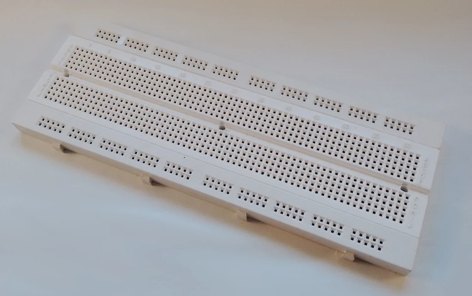

## ¿Qué es Arduino?

Arduino es una placa controladora y su entorno de programación que permiten de manera **rápida y sencilla** realizar proyectos de electrónica, automatismo, control, domótica, etc. Arduino nació en el Instituto IVREA (Italia) para facilitar a sus alumnos las tareas de programación de microcontroladores. Es ese uno de los motivos de su éxito: cualquier persona con pocos conocimientos de informática y electrónica puede programarlo e implementarlo.

Existen varios modelos de Arduino como son Uno, Leonardo, Mega... pero este tutorial se limitará salvo que se diga lo contrario al modelo Uno por ser el más común y económico.

## Hardware libre

El otro motivo del gran éxito de esta plataforma podemos encontrarlo en que es desarrollado cómo [hardware libre](https://es.wikipedia.org/wiki/Hardware_libre) . ¿qué es eso de hardware libre? Pues es lo análogo al [software libre](https://es.wikipedia.org/wiki/Software_libre) . Sus esquemas, especificaciones y planos están disponibles al público, por tanto cualquiera que acceda a ellos puede fabricarse una copia idéntica al original.

Pero no sólo eso, además, cualquier usuario o fabricante puede crear accesorios compatibles con lo que las posibilidades de realizar nuevos proyectos se multiplican. Esto atrae nuevos usuarios, algunos de los cuales crean nuevos accesorios y tienen nuevas ideas con lo que estamos retroalimentando una comunidad de usuarios y fabricantes que no para de crecer.

## ¿Para qué sirve?

Si estás leyendo esto seguramente es porque ya le has visto alguna aplicación y te ha picado el gusanillo. Aquí veremos algunas aplicaciones aunque las posibilidades son tantas como las que permite cualquier placa con microcontrolador: infinitas.

En general, podemos decir que un microcontrolador se utiliza para ordenar una serie de acciones en función de las entradas que le lleguen. Por ejemplo, encender un ventilador cuando la lectura de temperatura supere un cierto valor. Otras veces su tarea es realizar una serie de acciones sucesivamente sin hacer ninguna lectura. Éste caso sería el de utilizar Arduino para encender alternativamente las luces de un semáforo.

Cuando acabes el tutorial seguro que se te ocurren decenas de proyectos que podrás realizar.

 

## Partes de Arduino

 

En este apartado veremos las distintas partes que conformar nuestro Arduino como son entradas, salidas, alimentación, comunicación y shields.

- **Entradas:** son los pines de nuestra placa que podemos utilizar para hacer lecturas. En la placa Uno son los pines digitales (del 0 al 13) y los analógicos (del A0 al A5).
- **Salidas:** los pines de salidas se utilizan para el envío de señales. En este caso los pines de salida son sólo los digitales (0 a 13).
- **Otros pines:** también tenemos otros pines como los GND (tierra), 5V que proporciona 5 Voltios, 3.3V que proporciona 3.3 Voltios, los pines REF de referencia de voltaje, TX (transmisión) y RX (lectura) también usados para comunicación serial, RESET para resetear, Vin para alimentar la placa y los pines ICSP para comunicación SPI.
- **Alimentación:** Como hemos visto el pin Vin sirve para alimentar la placa pero lo más normal es alimentarlo por el jack de alimentación usando una tensión de 7 a 12 Voltios. También podemos alimentarlo por el puerto USB pero en la mayoría de aplicaciones no lo tendremos conectado a un ordenador.
- **Comunicación:** En nuestros tutoriales nos comunicaremos con Arduino mediante USB para cargar los programas o enviar/recibir datos. Sin embargo no es la única forma que tiene Arduino de comunicarse. Cuando insertamos una shield ésta se comunica con nuestra placa utilizando los pines ICSP (comunicación ISP), los pines 10 a 13 (también usados para comunicación ISP), los pines TX/RX o cualquiera de los digitales ya que son capaces de configurarse como pines de entrada o salida y recibir o enviar pulsos digitales.
- **Shields:** traducido del inglés significa escudo. Se llama así a las placas que se insertan sobre Arduino a modo de escudo ampliando sus posibilidades de uso. En el mercado existen infinidad de shields para cada tipo de Arduino. Algunas de las más comunes son las de Ethernet, Wi-Fi, Ultrasonidos, Pantallas LCD, relés, matrices LED's, GPS...

## Todo lo que necesitas para empezar

Una de las primeras cosas que se pregunta uno antes de empezar en este mundo es si el equipo es demasiado caro. La respuesta es que no, todo lo contrario.

Una placa Arduino Uno original cuesta 20,00€ y lo podéis pedir desde la propia [web de Arduino](https://store.arduino.cc/) . También tenemos placas de otros fabricantes por unos 11€ igualmente válidas gracias al carácter hardware libre de esta plataforma. Si no tenéis prisa, desde China también las podemos encontrar por unos 5€ , pero pueden tardar más de un mes en llegarnos.

El entorno de programación IDE es totalmente gratuito y podemos descargarlo pinchando [aquí](https://www.arduino.cc/en/Main/Software) .

Es muy aconsejable una [protoboard](https://es.wikipedia.org/wiki/Placa_de_pruebas) o placa de prototipos (breadboard en inglés) para realizar las pruebas y montajes. Suelen valer entre 5€ y 10€ .

También nos facilitará el trabajo un juego de cables con pines macho para insertar en Arduino y en la protoboard. No suelen costar más de 3€ . Una alternativa es pelar cables y estañarles las puntas para que no se deshilachen al meterlos en los agujeros.

Las shield tienen precios muy dispares y van desde los 5€ a 200€ o más, pero en este tutorial no haremos uso de ninguna de ellas.

Los componentes electrónicos adicionales de cada proyecto, como pueden ser resistencias, condensadores, fotoresistencias, led's, zumbadores... tienen en su mayoría precios de pocos céntimos y rara vez superan el euro.

En definitiva, **por menos de 30€** podemos hacernos con un equipo que nos permitirá realizar multitud de proyectos.

Esto es todo de momento. En el siguiente post encontrarás toda la información para manejarte por el entorno de programación de Arduino y ejecutar tu primer programa.

[Ver Indice Tutorial](https://openwebinars.net/blog/tutorial-de-arduino/)