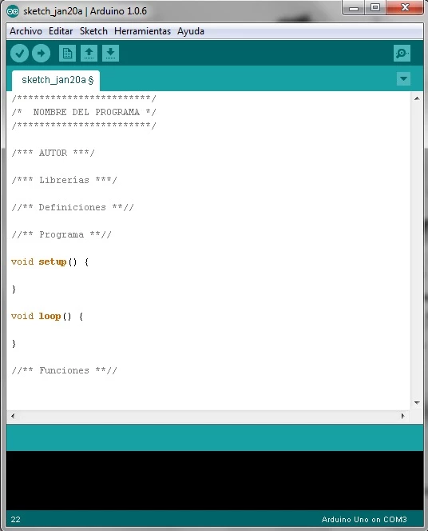
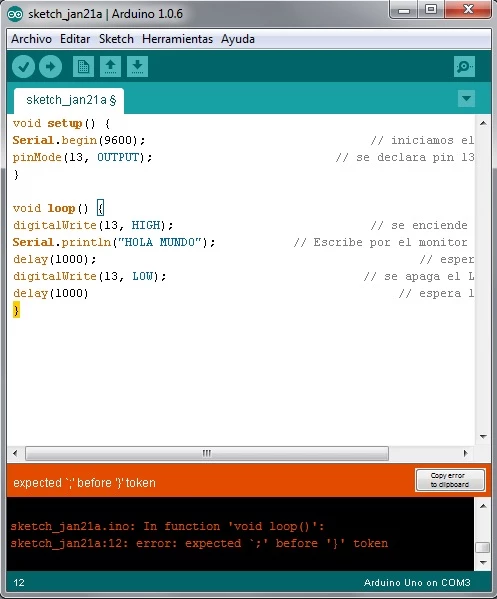
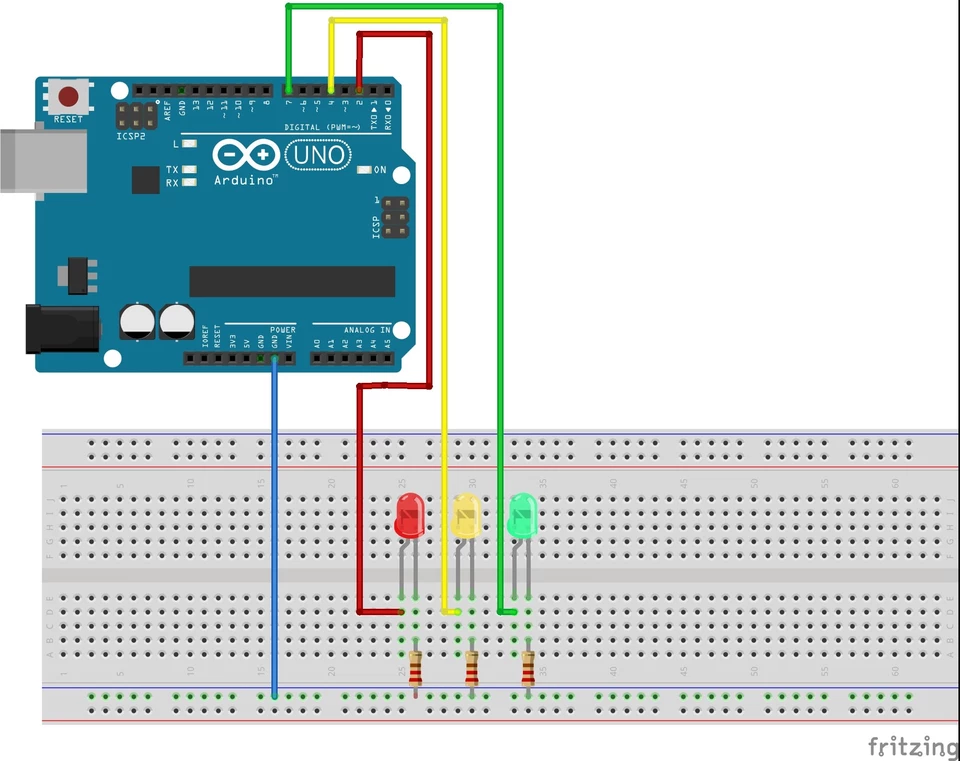
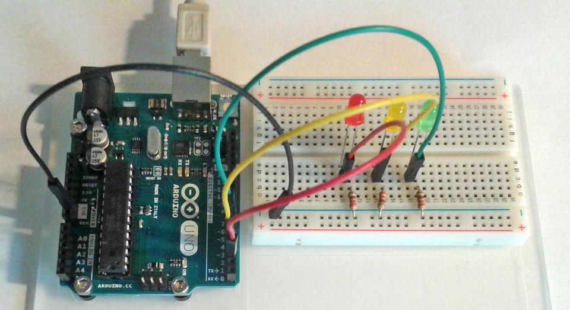

En este nuevo post daremos unas pautas sobre cómo debe estructurar un programa en Arduino, también veremos cómo son las sentencias básicas usadas con esta IDE, cómo cargar nuestro programa a la placa y para finalizar, realizaremos un ejemplo con el que encenderemos leds con Arduino montando nuestro propio semáforo. Aprovecho para recomendarte que comiences nuestro [Curso de Arduino](https://openwebinars.net/cursos/arduino/) para avanzar más en este apasionante mundo.

Estructura básica de los códigos

Un código Arduino es una serie de comandos de programación que le dirán a nuestro microcontrolador como configurarse al iniciarse y qué acciones tiene que realizar mientras esté en funcionamiento. Estos comandos utilizados en Arduino son sentencias muy fáciles e intuitivas.

 

El bloque de código debe tener 2 partes, o funciones principales, que siempre debemos incluir.

 

 


*Partes básicas de un código*

 

Primero **void setup()** . Dentro de esta función principal escribiremos las sentencias de configuración que necesitaremos para que Arduino trabaje correctamente. Éstas se ejecutarán al iniciar Arduino y una única vez. Con ellas, por ejemplo, asignaremos la característica de entrada/salida a los pines, el modo de comunicación serial, activaremos los sensores que vayamos a necesitar, escribiremos órdenes de inicio del programa…etc. Algunas de estas sentencias pueden ser: pinMode( , ), Serial.begin(,), sensors.begin(,)…

La segunda función principal es **void loop()** . Ésta debe ir siempre después de void setup(). En ella escribiremos todas las sentencias, bucles y llamadas a funciones que necesitemos que nuestro Arduino repita constantemente. Se escribirán en orden de ejecución. Ejemplo de éstas pueden ser digitalWrite( , ), Serial.print(“ “), if( )…

Existen otras partes del código que no son obligatorias pero que podemos necesitar, según el código lo requiera, para organizarlo todo.

 

Estas zonas pueden ser un espacio para el título, el autor, librerías, definiciones (variables que vayamos a usar en el programa), una zona para funciones a las que el programa irá llamando…Cada uno es libre de organizarlo como quiera, pero cuanto más ordenado esté todo, más difícil será perdernos cuando los códigos se compliquen.

Abajo podemos ver un ejemplo simple de cómo debe estructurarse un código.

 

 


*Cómo debe estructurarse un código*

### Sentencias básicas, funciones y librerías

Para poder realizar un código Arduino debemos tener las herramientas con las que decirle a nuestro microcontrolador que es lo que debe hacer en cada momento. Estas herramientas son las **sentencias y funciones** .

Arduino usa una serie de sentencias y comandos básicos muy sencillitos pero a la vez muy potentes. Combinándolos crearemos programas para decirle a nuestra placa que haga prácticamente cualquier cosa que queramos.

Las sentencias se dividen por su manera de funcionar dentro del programa, pudiendo dividirlas en 3 grandes grupos:

- **Estructurales** : Nos dan la forma computacional del código y las operaciones lógicas a ejecutar. Con éstos son con los que le marcamos al programa qué camino debe seguir el código al ejecutarse y qué operaciones debe hacer. Algún ejemplo de las más usadas son if, for, while, +, -, =, *, /, ==, >, < …
- **Variables** : Con éstas definiremos qué tipo y qué características tendrán los valores que vamos a usar en el código. Pueden ser números, caracteres o estados. Podemos encontrarnos aquí las sentencias int, float, HIGH, LOW, char, string, true, false…
- **Funciones** : Nos permiten realizar una serie de operaciones concretas y volver a la zona del código en la que se ejecutó. Existen funciones que están propiamente definidas ya por Arduino como tales y también podemos crearnos nuestras propias funciones para que sean llamadas en las zonas de setup o loop cuando lo necesitemos. Son muy útiles cuando necesitamos realizar un grupo de acciones varias veces en distintas zonas del código. También es una buena forma de ahorrar líneas y de organizarse. Ejemplo de funciones tenemos pinMode, digitalWrite, delay, max, sin, cos, analogWrite…

Como explicar qué acción concreta realiza cada sentencia o función sería muy extenso, os dejamos [este enlace](https://www.arduino.cc/reference/es/) para que podáis consultarlos. Nosotros iremos comentando todos los que vayamos usando en nuestros ejemplos.

 

Otra cosa importante son las **librerías** . Son una serie de sentencias y funciones específicas de cada elemento o shield que conectemos a Arduino, que no están dentro de las propias de la IDE, y que realizarán acciones específicas de cada uno facilitándonos mucho la programación.

Por último nombraremos un par de pequeños detalles necesarios para poder programar nuestro código. Para que cada sentencia o función se ejecute debe llevar al final de cada orden el signo de puntuación punto y coma “ ; “ y al utilizar la doble barra “ // ” le decimos al código que lo que se escriba a la derecha es un comentario y que no debe ejecutarlo (Arduino lo coloreará en gris). Esto veréis que es muy útil para explicar que estamos haciendo en cada momento.

### Compilación y carga.

Una vez que hayamos escrito nuestro código en la IDE Arduino procederemos a verificar que está correctamente escrito. Para ello pulsamos el botónarriba a la izquierda. Arduino leerá el texto y nos dirá si es correcto o no. Para ello lo que hará será compilarlo, que significa traducir el código del lenguaje de programación a un lenguaje que entienda el microcontrolador directamente.

En el caso de contener un error nos aparecerá en la consola una explicación orientativa del error.


*Verificando el código*

 


 

 

**Código correcto**


 



 

 

**Error en el código. Falta un ";"**


 

Si la compilación ha sido correcta, ya podremos cargar nuestro programa al Arduino. Para ello, con la placa conectada por USB, pulsamos el botón de cargay esperamos a que termine.


*Carga de programa terminada*

### Ejemplo: Semáforo

 

Como primer proyecto, realizaremos un semáforo con unos Leds. Es ideal para iniciarnos en la programación y el montaje de circuitos porque, como veréis, es muy fácil.

Empezaremos nuestro primer proyecto describiendo los elementos que vamos a necesitar.

 

- 1 x Arduino UNO R3
- 1 x Protoboard
- 1 x Led rojo 3mm
- 1 x Led amarillo 3mm
- 1 x Led verde 3mm
- 3 x resistencias de 220Ω.
- Cables para conectar todo.

 

Una vez que tenemos todo, hacemos nuestro montaje siguiendo el siguiente esquema.



**Esquema de montaje del semáforo**


 

Utilizaremos los pines digitales **2** (rojo), **4** (amarillo) y **7** (verde). Al conectar los Leds debéis tener en cuenta que tienen polaridad, por lo que tenéis que colocarlos bien para que funcionen. En los Leds la patilla corta, o el lado que está achatado, es el negativo e irá conectado a tierra (GND en la placa) a través de una resistencia. La patilla larga, o lado redondeado, es el positivo y se conectará al pin del Arduino correspondiente.



*Protoboard del proyecto semáforo*


 

Una vez montado, abriremos nuestro IDE Arduino y escribiremos el programa ( **sketch** ).

```
/*************/
/*  SEMAFORO */
/*************/

/*** Fernando Martinez Mendoza ***/

//** Definiciones **//
int rojo=2;      //definimos el valor del pin para el led rojo
int amarillo=4;  //definimos el valor del pin para el led amarillo
int verde=7;     //definimos el valor del pin para el led verde

//** Programa **//

void setup() {
  pinMode(verde,OUTPUT);   //declaramos el pin verde como salida  
  pinMode(amarillo,OUTPUT);//declaramos el pin amarillo como salida
  pinMode(rojo,OUTPUT);    //declaramos el pin rojo como salida  
}

void loop() {
 digitalWrite(verde,HIGH); //encendemos el led rojo
 delay(2000);             //esperamos 2 segundos
 digitalWrite(verde,LOW);  //apagamos el led rojo
 delay(500);              //esperamos medio segundo
 
 digitalWrite(amarillo,HIGH); //encendemos el led amarillo
 delay(2000);                 //esperamos 2 segundos
 digitalWrite(amarillo,LOW);  //apagamos el led amarillo
 delay(500);                  //esperamos medio segundo
 
 digitalWrite(rojo,HIGH); //encendemos el led verde
 delay(2000);              //esperamos 2 segundos
 digitalWrite(rojo,LOW);  //apagamos el led verde
 delay(500);               //esperamos medio segundo
}
```

 

Con la sentencia **int** estamos declarando una variable numérica entera, para poderla usar después en nuestro código.

El comando **delay** hace que el programa pare un tiempo determinado. Éste lo definiremos, en milisegundos, dentro de los paréntesis.

Las funciones pinMode y digitalWrite se explicarán en el siguiente post, **salidas** , con detalle.

 

Espero que os hayáis divertido con este post y que comencéis a cogerle el gusanillo al mundo del Arduino.