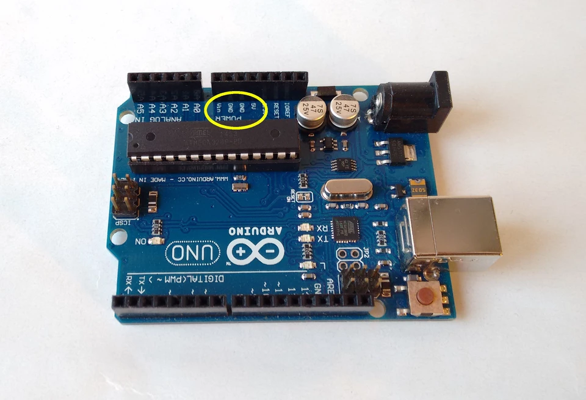
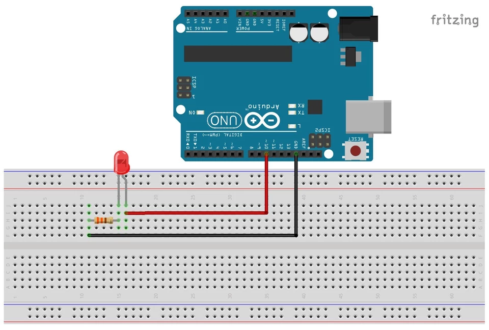

## Pines de salida

Arduino utiliza sus pines de salida para enviar señales eléctricas. Éstas señales pueden utilizarse para alimentar otros dispositivos (led's, zumbadores...) o para comunicarse enviando una serie de pulsos que el receptor debe entender.

Las salidas se dividen en dos niveles o estados: HIGH a 5 V y LOW a 0 V. Por defecto, y sin ningún programa cargado en nuestra tarjeta controladora, las salidas están a nivel LOW. Para valores intermedios veremos los pines con función PWM en el punto 2.

Para valores constantes de 5V, 3.3V y 0V (GND) podemos utilizar los pines correspondientes del apartado “POWER” de nuestro Arduino.



 

## Configuración y uso de las salidas digitales

Los pines que podemos configurar para que cambien el nivel de salida según nuestro programa son los digitales, es decir, los 1 a 13. En realidad existen otros pines digitales pero no serán tratados en este tutorial.


Por defecto estos pines están configurados como entradas así que lo primero que tenemos que hacer para utilizar un pin como salida es configurarlo como tal. Para ello escribimos esta sentencia dentro del apartado *setup* del programa.

```
pinMode(pin,OUTPUT);
```

Donde sustituiremos "pin" por el número del pin que queremos configurar como salida. También podemos almacenar el número de ese pin en una variable, por ejemplo el pin 10 en la variable llamada "pinsalida" y escribirla dentro de la función *pinMode* .

```c++
int pinsalida = 10;                          // almacena el número 10 en la variable "pinsalida"

pinMode(pinsalida,OUTPUT);        // configura el pin número "pinsalida" (10) como salida
```

Ahora ya lo tenemos configurado como salida pero aún sigue a 0 V, es decir, a nivel LOW. Cuando en un determinado momento del programa queramos que ese pin se ponga a nivel HIGH escribiremos esta sentencia

```c++
digitalWrite(pinsalida,HIGH);
```

Ahora tendremos 5 V permanentemente en ese pin a no ser que en el programa insertemos

```c++
digitalWrite(pinsalida,LOW);
```

en cuyo caso se volverá al valor de 0 V. Podemos poner los pines a HIGH o LOW tantas veces como queramos.

IMPORTANTE : hay que tener en cuenta que estos pines tienen una **intensidad limitada a 40 mA** , por tanto no será suficiente para alimentar a algunos relés, motores, bombillas y todo aquello que necesite mayor corriente. En otros post veremos cómo solucionamos este "problema".

 

## PWM

La función PWD nos permite obtener valores intermedios de salidas entre 0 y 5V escalados en en 255 niveles, siendo 0 el más bajo (0 V) y 255 el más alto (5 V).

Lo que en realidad sucede es que el microcontrolador alterna rapidísimamente estados HIGH y LOW un tiempo proporcional al valor requerido. Así, con 127 estaría el 50% del tiempo a HIGH y el otro 50% restante a LOW. Nosotros no lo notamos porque todo ello sucede a una frecuencia superior a la que captan nuestros ojos.

Los pines que permiten esta función están señalados con el símbolo ~ . En la placa Uno son los pines 3, 5, 6, 9, 10 y 11.

Si como vimos en en anterior apartado ya tenemos nuestro pin configurado como salida, para obtener un nivel de salida de 75% escribiremos en nuestro programa

```c++
analogWrite(pinsalida,191);
```

Ya que 191 es el 75% de 255.

 

## Ejemplo función PWM con LED

Este ejemplo consta de dos partes. Primero un led se encenderá durante dos segundos. Luego variará su intensidad entre los valores máximo y mínimo gradualmente. Para conseguirlo utilizaremos uno de los pines PWM.

El montaje es de lo más sencillo. Insertamos el led en la protoboard. Para no dañar el led ponemos en serie una resistencia de unos 220-470 Ohmios. Con valores menores se corre el riesgo de dañarlo y valores mayores atenúan demasiado el brillo.

 

 



 

Seguidamente unimos mediante cables el pin 10 con la fila del ánodo (pata larga) y el GND con la fila del extremo libre de la resistencia. Si el led tiene las patas iguales, una forma de distinguir el cátodo del ánodo es fijándose en el borde del led que no es completamente circular. Pues la parte biselada corresponde al cátodo.

Ahora vamos con el programa. En la primera parte declaramos las variables.

```c++
int pinsalida = 10;            // variable para guardar el número del pin
int velocidad = 100;         // variable para cambiar la velocidad de encendido/apagado
int pwm;                         // variable que almacenará el valor entre 0 y 255
```

Cambiando el valor de la variable velocidad haremos que el led tarde más o menos tiempo en completar los ciclos de cambio de intensidad.

En la función *setup* hacemos que el led se encienda 2 segundos y luego se apague.

```c++
void setup()
{
    pinMode(pinsalida,OUTPUT);        // configura "pinsalida" como salida
    digitalWrite(pinsalida,HIGH);     // pone el "pinsalida" a nivel alto
    delay(2000);                      // espera 2000 milisegundos (2 segundos)
    pinMode(pinsalida,LOW);           // pon "pinsalida a nivel bajo
    delay(1000);                      // espera 1 segundo
}
```

En la función loop hacemos uso del PWM. Escribimos un bucle for que dará a la variable pwm un valor inicial de 0 y lo irá incrementando en una unidad hasta que alcance el valor máximo de 255. A continuación ponemos otro bucle for que irá decrementando el valor desde el máximo hasta el mínimo.

```c++
void loop()
{ 
    for(pwm=0;pwm<256;pwm++)        // desde pwm valiendo 0; hasta que valga 255; incrementa pwm
    {
        analogWrite(pinsalida,pwm);       // pone el "pinsalida" a el valor que almacena la variable "pwm"
        delay(1000/velocidad);                // espera (1000/velocidad) milisegundos
    }
    for(pwm=255;pwm>-1;pwm--)        // este bucle hace lo mismo pero decrementando pwm
    {
        analogWrite(pinsalida,pwm);
        delay(1000/velocidad);
    }
}
```

El programa entero quedaría así.

```c++
/***********************/
/*     ejemplo led pwm     */
/***********************/

int pinsalida = 10;            // variable para guardar el número del pin
int velocidad = 100;         // variable para cambiar la velocidad de encendido/apagado
int pwm;                         // variable que almacenará el valor entre 0 y 255

void setup()
{
    pinMode(pinsalida,OUTPUT);        // configura "pinsalida" como salida
    digitalWrite(pinsalida,HIGH);     // pone el "pinsalida" a nivel alto
    delay(2000);                      // espera 2000 milisegundos (2 segundos)
    pinMode(pinsalida,LOW);           // pon "pinsalida a nivel bajo
    delay(1000);                      // espera 1 segundo
}

void loop()
{ 
    for(pwm=0;pwm<256;pwm++)        // desde pwm valiendo 0; hasta que valga 255; incrementa pwm
    {
        analogWrite(pinsalida,pwm);       // pone el "pinsalida" a el valor que almacena la variable "pwm"
        delay(1000/velocidad);                // espera (1000/velocidad) milisegundos
    }
    for(pwm=255;pwm>-1;pwm--)        // este bucle hace lo mismo pero decrementando pwm
    {
        analogWrite(pinsalida,pwm);
        delay(1000/velocidad);
    }
}
```

