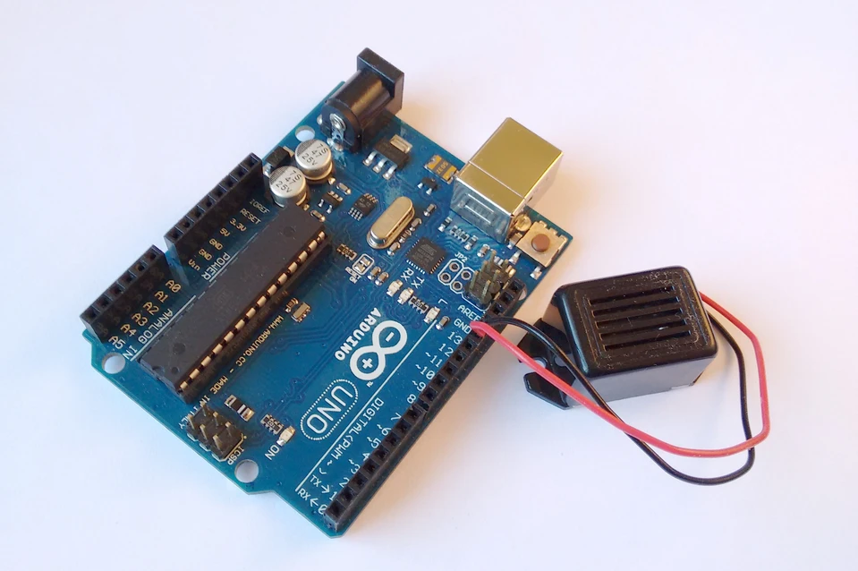
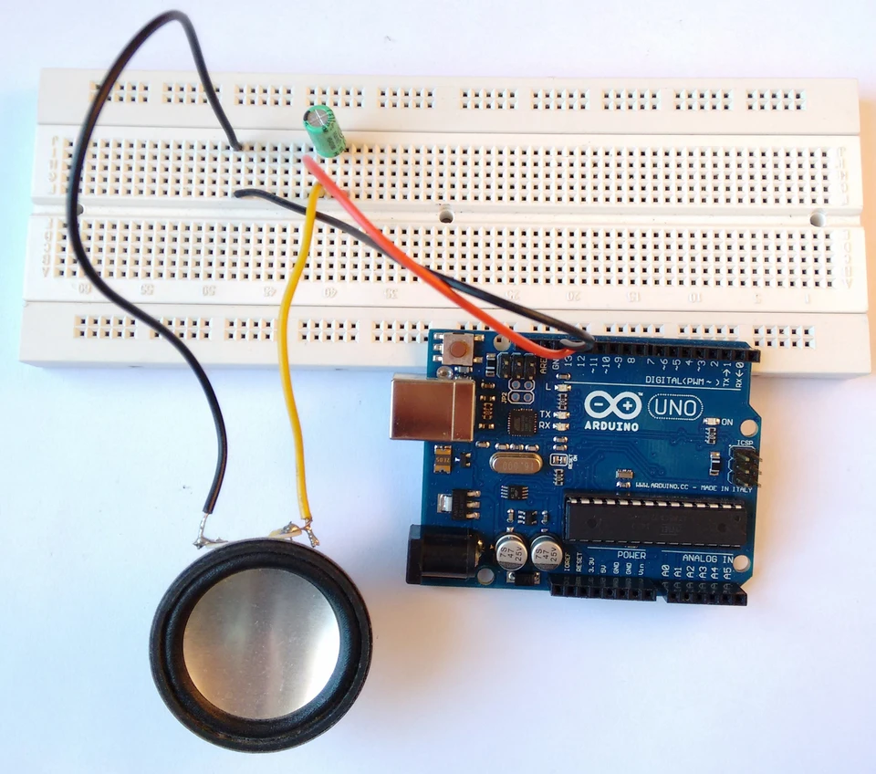

## Sonidos con Arduino

Función tone

Con Arduino también podemos crear sonidos gracias a la función *tone* cuya sintaxis es la siguiente:

```
tone(pinsalida,frecuencia);
```

Esta función lo que hace es intercambiar valores HIGH/LOW a la frecuencia deseada en el pin seleccionado hasta que la volvemos a llamar con otra frecuencia o le ordenamos que pare con esta función

```
noTone(pinsalida);
```

Tenemos que tener en cuenta que **sólo es capaz de generar un único tono a la vez** . Si llamamos a la función *tone* para que genere sonidos en otro pin sin haber detenido el que está sonando no ocurrirá nada.

Zumbador

Un zumbador es un elemento parecido a un altavoz pero sólo emite zumbidos (típico sonido que emiten los electrodomésticos). Su precio suele rondar los 2€ .

Para hacerlo sonar utilizaremos los pines 13 y GND. El montaje no merece más explicación que la de la imagen.




 

Ya sólo falta crear el código y cargarlo. En la función *loop* hacemos la llamada a *tone* para que suene y *noTone* para detener el sonido. Cambiando los valores de la función *delay* haremos que suene durante más o menos tiempo.

 

```
int pinzumbador = 13;    // pin del zumbador
int frecuencia = 220;      // frecuencia correspondiente a la nota La

void setup()
{
}

void loop()
{
    tone(pinzumbador,frecuencia);    // inicia el zumbido
    delay(2000);                    
    noTone(pinzumbador);               // lo detiene a los dos segundos
    delay(1000);
}
```

Podemos observar dos cosas:

- Al cargar el programa suena brevemente el zumbador. Esto se debe a que utilizamos el pin 13 y éste se pone a HIGH brevemente unas veces cuando se inicia la placa.
- Si variamos la frecuencia a penas varía el tono o no suena. La causa de ésto es que un zumbador tiene poca capacidad para reproducir sonidos fielmente. La frecuencia influye tan poco que incluso sonaría conectándolo entre los pines 5V y GND. Para frecuencias demasiado altas el zumbador no responde.


Música

En este punto utilizaremos un pequeño altavoz. Podéis aprovechar uno que tengáis en algún aparato que no utilicéis.
El mismo montaje servirá para los dos ejemplos siguientes. El primero consistirá en reproducir una escala de 220 a 440 HZ con todos sus semitonos. En el segundo reproduciremos música.


Si os fijáis en el esquema he puesto un condensador (~0.20€) en serie con el altavoz. Ésto es para eliminar cualquier componente de continua. Tened en cuenta que si elegís valores muy pequeños puede recortar las frecuencias más bajas. Con valores de 47 uF o mayores va bien. IMPORTANTE: Si usáis condensadores electrolíticos (los cilíndricos) tenéis que tener en cuenta que tienen polaridad y si lo colocáis al revés pueden explotar . Fijaros que tienen una franja con signos “-” en la pata negativa.




Vamos con el primer ejemplo. Para no almacenar todas las frecuencias y tener que escribir la función *tone* en nuestro código cada vez que queramos una nueva nota, haremos un pequeño truco. Almacenaremos sólo el valor de la frecuencia inicial, y las sucesivas notas tendrán la frecuencia de la anterior multiplicada por 1,059. De este modo escribiremos una sola vez la función para hacerlo sonar y un bucle *for* será el encargado de ir incrementando el valor de la frecuencia.

```
/***********************/
/* recorrido de octava */
/***********************/

int pinaltavoz = 13;
int frecuencia=220;    // frecuencia correspondiente a la nota La
int contador;          // variable para el contador
float m=1.059;         // constante para multiplicar frecuencias

void setup()
{
}

void loop()
{
    for(contador=0,frecuencia=220;contador<12;contador++)
    {
        frecuencia=frecuencia*m;     // actualiza la frecuencia
        tone(pinaltavoz,frecuencia); // emite el tono
        delay(1500);                 // lo mantiene 1.5 segundos
        noTone(pinaltavoz);          // para el tono
        delay(500);                  // espera medio segundo
    }
}
```

Ahora pasamos a lo bueno: **reproducir música** , pero de la que recuerda a los videojuegos con música de 8 bits.
En este código utilizaremos una función auxiliar que llamaremos *not* a con la siguiente estructura

```
nota(frecuencia,duración);
```

La ventaja es que nos ahorrará escribir decenas de veces la función *delay* para indicar el tiempo que debe durar la nota. Cada vez que llamemos a esa función se ejecutará esta parte del código

```
void nota(int frec, int t)
{
    tone(spk,frec);      // suena la nota frec recibida
    delay(t);                // para despues de un tiempo t
}
```

Os dejo varios fragmentos de canciones. Podéis buscar partituras de canciones y pasar las notas a frecuencia y tiempo.

```
/**************************/
/*     popurri para Arduino     */  
/**************************/

/**************** Antonio Guillermo Pérez Coronilla ***************/

/* declaración de variables */
int spk=13;                                           // altavoz a GND y pin 13
int c[5]={131,262,523,1046,2093};       // frecuencias 4 octavas de Do
int cs[5]={139,277,554,1108,2217};      // Do#
int d[5]={147,294,587,1175,2349};       // Re
int ds[5]={156,311,622,1244,2489};    // Re#
int e[5]={165,330,659,1319,2637};      // Mi
int f[5]={175,349,698,1397,2794};       // Fa
int fs[5]={185,370,740,1480,2960};     // Fa#
int g[5]={196,392,784,1568,3136};     // Sol
int gs[5]={208,415,831,1661,3322};   // Sol#
int a[5]={220,440,880,1760,3520};      // La
int as[5]={233,466,932,1866,3729};    // La#
int b[5]={247,494,988,1976,3951};      // Si

void nota(int a, int b);            // declaración de la función auxiliar. Recibe dos números enteros.

void setup()
{  
/**************************************/
/*                  HARRY POTTER                    */
/**************************************/
nota(b[2], 500);          
nota(e[3],1000); 
nota(g[3], 250);
nota(fs[3],250);
nota(e[3],1000);
nota(b[3],500);
nota(a[3],1250);
nota(fs[3],1000);    
nota(b[2], 500);
nota(e[3],1000);
nota(g[3],250);  
nota(fs[3],250);
nota(d[3],1000);
nota(e[3],500 );
nota(b[2],1000 );    
noTone(spk); delay(1000);   
nota(b[2], 500);
nota(e[3],1000);
nota(g[3], 250);
nota(fs[3],250);
nota(e[3],1000);
nota(b[3],500);
nota(d[4],1000);
nota(cs[4],500);
nota(c[4],1000);
nota(a[3],500);
nota(c[4],1000);
nota(b[3],250);
nota(as[3],250);
nota(b[2],1000);
nota(g[3],500);
nota(e[3],1000);
noTone(spk); 
delay(2000);       

/*******************/
/*     STAR WARS      */
/*******************/
/**** tema principal ****/
nota(d[1],150);noTone(spk);delay(50);
nota(d[1],150);noTone(spk);delay(50);
nota(d[1],150);noTone(spk);delay(50);
nota(g[1],900);noTone(spk);delay(150);
nota(d[2],900);noTone(spk);delay(50);
nota(c[2],150);noTone(spk);delay(50);
nota(b[1],150);noTone(spk);delay(50);
nota(a[1],150);noTone(spk);delay(50);
nota(g[2],900);noTone(spk);delay(150);
nota(d[2],900);noTone(spk);delay(100);
nota(c[2],150);noTone(spk);delay(50);
nota(b[1],150);noTone(spk);delay(50);
nota(a[1],150);noTone(spk);delay(50);
nota(g[2],900);noTone(spk);delay(150);
nota(d[2],900);noTone(spk);delay(100);
nota(c[2],150);noTone(spk);delay(50);
nota(b[1],150);noTone(spk);delay(50);
nota(c[2],150);noTone(spk);delay(50);
nota(a[1],1200);noTone(spk);delay(2000);

/**** marcha del imperio   ****/
nota(g[2],500);noTone(spk);delay(100);
nota(g[2],500);noTone(spk);delay(100);
nota(g[2],500);noTone(spk);delay(100);
nota(ds[2],500);noTone(spk);delay(1);
nota(as[2],125);noTone(spk);delay(25);
nota(g[2],500);noTone(spk);delay(100);
nota(ds[2],500);noTone(spk);delay(1);
nota(as[2],125);noTone(spk);delay(25);
nota(g[2],500);
noTone(spk);delay(2000);

/**********************/
/*     entre dos aguas     */
/**********************/
nota(a[1],400);noTone(spk);delay(400);
nota(e[1],400);noTone(spk);delay(400);
nota(a[1],400);noTone(spk);delay(200);
nota(e[1],200);noTone(spk);delay(200);
nota(a[1],200);noTone(spk);delay(200);
nota(as[1],100);noTone(spk);delay(100);
nota(b[1],400);noTone(spk);delay(400);
nota(fs[1],400);noTone(spk);delay(400);
nota(b[1],400);noTone(spk);delay(200);
nota(fs[1],200);noTone(spk);delay(200);
nota(b[1],200);noTone(spk);delay(200);
nota(as[1],100);noTone(spk);delay(100);
nota(a[1],400);noTone(spk);delay(400);
nota(e[1],400);noTone(spk);delay(400);
nota(a[1],400);noTone(spk);delay(400);    
}

void nota(int frec, int t)
{
    tone(spk,frec);      // suena la nota frec recibida
    delay(t);                // para despues de un tiempo t
}

void loop()
{
}
```