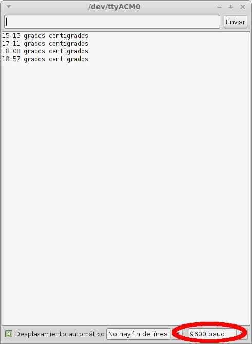

# Pines de entrada

Nuestro Arduino no sólo puede enviar señales sino que también puede recibirlas con dos propósitos principales como son leer datos de sensores y recibir mensajes de otros dispositivos (shield, otro Arduino, PC, etc.). Las entradas las clasificaremos en analógicas y digitales.

## Entradas analógicas

Las entradas analógicas del modelo Uno son las correspondientes a los pines de A0 a A5. Se caracterizan por leer valores de tensión de 0 a 5 Voltios con una resolución de 1024 (10 bits). Si dividimos 5 entre 1024 tenemos que ser capaz de detectar variaciones en el nivel de la señal de entrada de casi 5 mV.


Para hacer la lectura de uno de estos pines escribiremos en nuestro código

```
lectura = analogRead(pinentrada);
```

“lectura” lo sustituimos por el nombre de la variable donde queramos almacenar el valor leído y en “pinentrada” tendremos que poner el número del pin analógico que hemos elegido (0,1,...5) o el nombre de la variable que almacena dicho número.

Esta función nos devolverá un valor que va de 0 a 1023 en proporción al nivel de la señal de entrada. Para una entrada nula obtendremos el valor 0, para una entrada de 2.5 Voltios 511 (la mitad de 1023) y para 5 Voltios 1023.

## Entradas digitales

Las entradas digitales son las mismas que las salidas digitales, es decir, los pines que van del 1 al 13. Se diferencian de las analógicas porque éstas son capaces de “entender” sólo dos niveles de señal, LOW o valores cercanos a 0 V y HIGH o valores cercanos a 5 V. Puede parecer una desventaja pero en realidad puede ser todo lo contrario. Y no sólo porque a veces únicamente necesitemos saber dos estados (interruptor, pulsador, sensor de presencia, final de carrera....) sino porque así es capaz de leer señales de pulsos digitales. Esto significa que puede **comunicarse** .


Por poner un ejemplo, un sensor analógico de temperatura como es el LM35 incrementaría el nivel de la tensión que llega a la placa de forma proporcional a la temperatura. Sin embargo, uno digital como el ds18b20 lo que haría es cambiar la sucesión de pulsos y por tanto el mensaje que contiene el valor de la temperatura.

Aunque los pines digitales por defecto vienen configurados como entradas, si queremos hacerlo manualmente escribimos en nuestro código

```
pinMode(pinentrada,INPUT);
```

Para almacenar los dos valores posibles LOW o HIGH en una variable llamada “lectura” escribimos

```
lectura = digitalRead(pinentrada);
```

## Sensor de temperatura LM35

Este sensor de temperatura lo podéis encontrar por **poco más de 1€** . Es un sensor lineal, tiene una precisión de 0.5 ºC y una sensibilidad de 10 mV/ºC. Podéis encontrar más información en su [datasheet](http://www.ti.com/lit/ds/symlink/lm35.pdf) .


Vamos a hacer un pequeño proyecto para medir la temperatura ambiente y visualizarla en nuestro PC. Su montaje no lleva más de un par de minutos y podemos verlo claramente en el esquema. La pata +Vs va al pin 5V, la pata Vout al pin que utilicemos para la lectura, en este caso el 0, y la restante GND al pin GND. Tened en cuenta que el dibujo del LM35 está hecho con **vista desde las patas** . CUIDADO con colocarlo al revés porque si lo hacéis mal el sensor se calentará rápidamente y a parte de estropearlo os quemaréis al tocarlo.


El programa para este ejemplo es también muy simple y corto. Como siempre empezamos con la declaración de las variables. Esta vez, para almacenar la temperatura no utilizaremos una variable del tipo *int* sino *float* para poder almacenar decimales.

```
float temperatura;            // aquí almacenaremos el valor leído
int pinentrada = 0;           // utilizaremos el pin A
```

Lo siguiente es abrir el puerto serial en la función *setup* . Ésto se hace para poder comunicarnos desde nuestro ordenador con el controlador y así poder mostrar los datos por pantalla.

```
void setup()
{
    Serial.begin(9600);            // abrimos el puerto reial a 9600 bps
}
```


En el código quedaría así

```
void loop()
{
    temperatura = analogRead(pinentrada);                    // lectura del pin A0
    temperatura = (temperatura / 1023 * 5 / 0.01);         // "traduce" el valor leído a grados
    Serial.print(temperatura);                                         // escribe el valor de la temperatura por el puerto serial
    Serial.print(" grados centigrados \n");                       // escribe las unidades
    delay(1000);                                                             // espera 1 segundo
}  
```

Cargamos el código en la placa y sólo tenemos que pinchar en el icono del monitor serial


Si nos muestras caracteres extraños es que la configuración del monitor serial está comunicándose con una tasa bps distinta a los 9600 con los que hemos configurado nuestro puerto serial. Para corregirlo sólo tenemos que seleccionar el valor adecuado de la pestaña desplegable como se puede ver en la siguiente imagen.



Os dejo el programa entero para que sólo tengáis que copiar y pegar a vuestro IDE.

```
/*****************************/
/*  Medicion de Temperatura  */
/*    con el sensor LM35     */
/*****************************/

/****** declaracion de variables ******/
float temperatura;        // almacenara el valor leido
int pinentrada = 0;        // utilizaremos el pin A0

void setup()
{
    Serial.begin(9600); // abrimos el puerto serial a 9600 bps
}

void loop()
{
    temperatura = analogRead(pinentrada);                // lectura del pin A0
    temperatura = (temperatura / 1023 * 5 / 0.01);     // traduce el valor a ºC
    Serial.print(temperatura);                                      // escribe el valor por el puerto serial
    Serial.print(" grados centigrados \n");                   // escribe las unidades de ºC
    delay(1000);                                                         // espera un segundo
}  
```

 