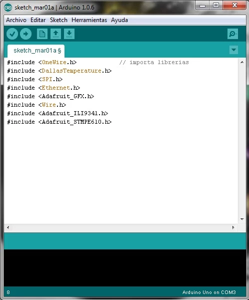
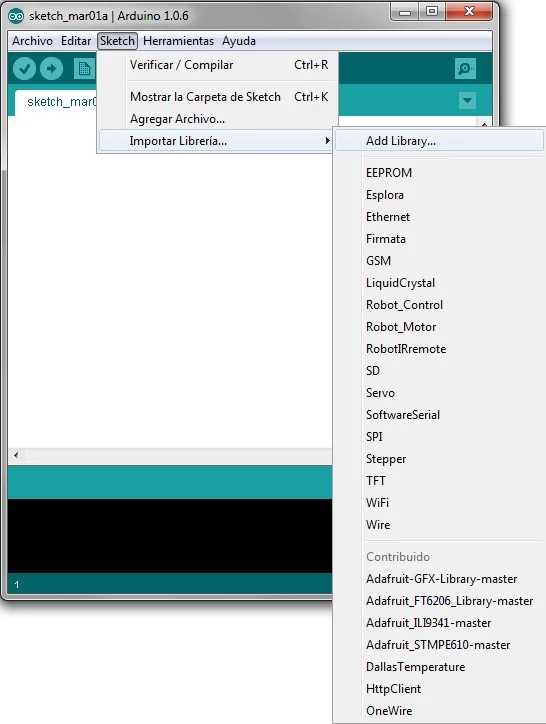
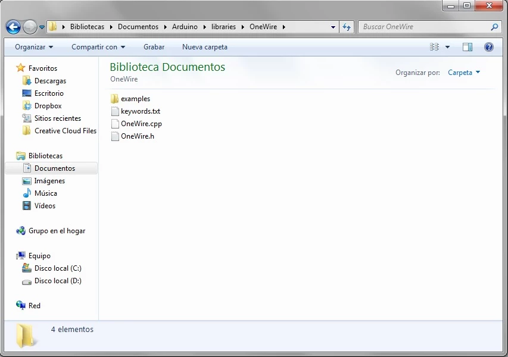
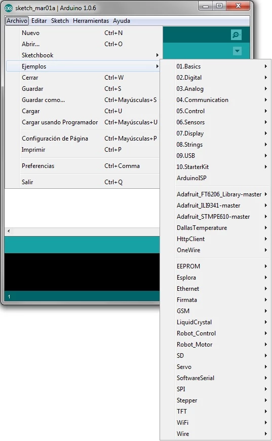
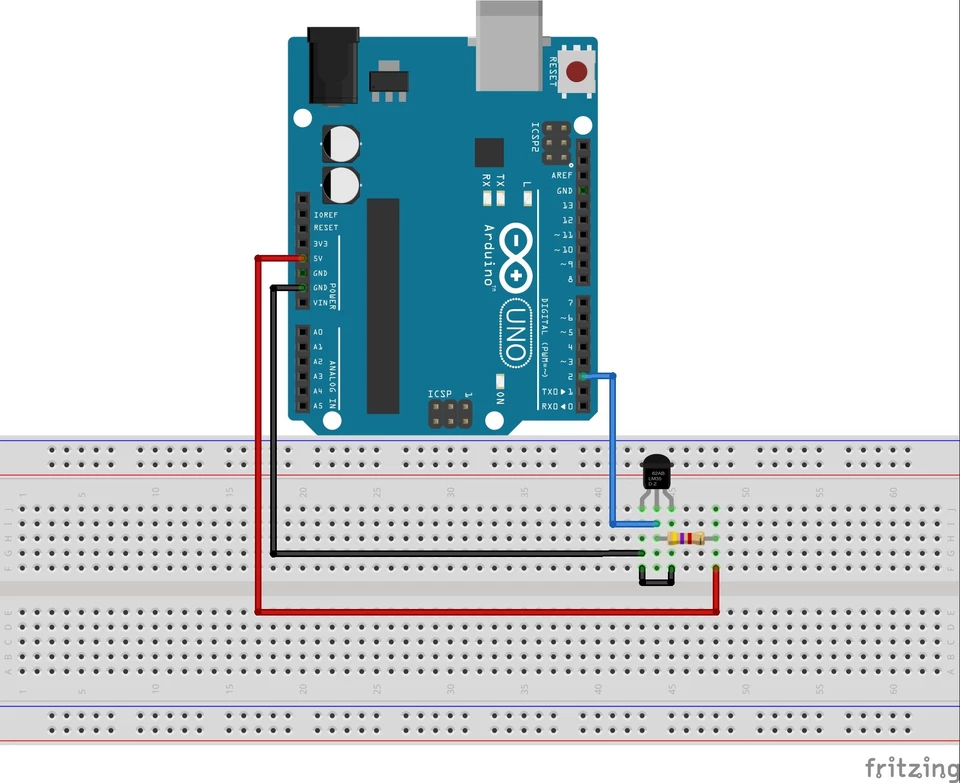
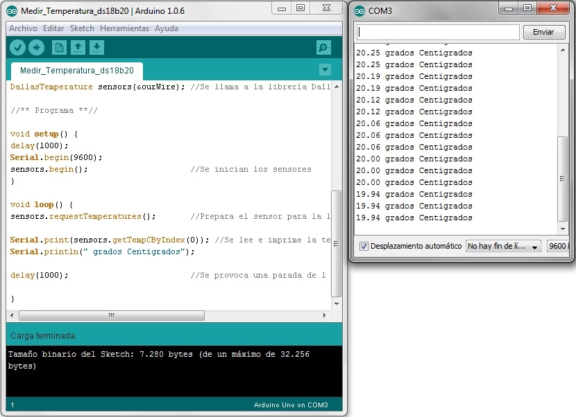
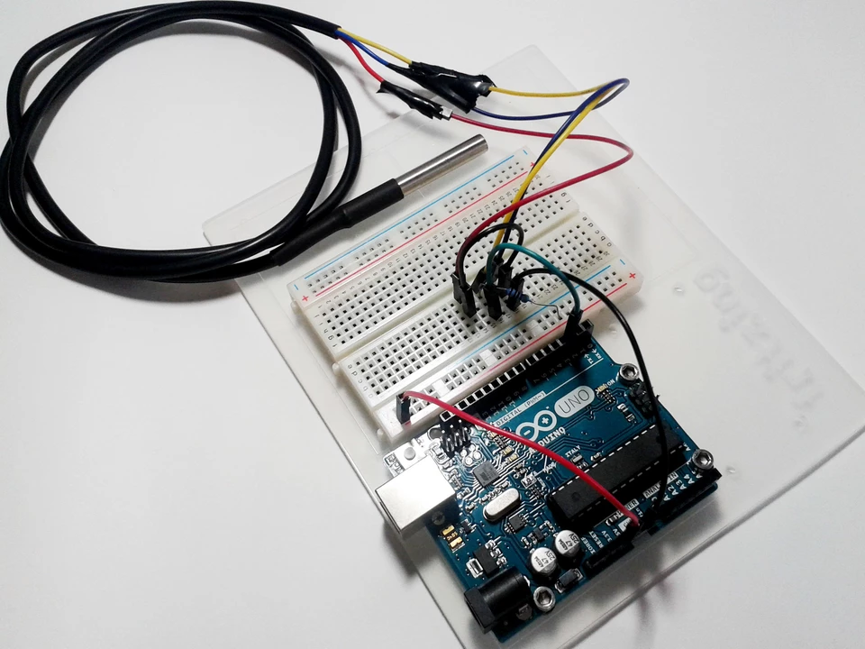

# OneWire

En este post, realizaremos un ejemplo de medición de temperatura con el sensor [ds18b20](https://datasheets.maximintegrated.com/en/ds/DS18B20.pdf). Este sensor, aparte de tener una buena precisión y una versión sumergible, funciona utilizando un sistema de conexionado muy particular. Este sistema se denomina **OneWire** . Con él conseguimos enviar y recibir datos por un único cable. Esto tiene sus ventajas e inconvenientes, pero no deja de ser una opción muy a tener en cuenta cuando vamos justos de conexiones de control para nuestro proyecto, ya que nos ahorramos un cable en cada sensor.

En otro ejemplo, ya realizamos mediciones de temperatura con un sensor. Lo interesante de este ejemplo no es el medir la temperatura, si no aprender el funcionamiento del sistema OneWire, para poder usarlo en cualquier sensor que lo utilice, y la instalación e importado de librerías de terceros.
Existen muchos detractores de este sistema, que ponen de manifiesto que el usarlo exige unos códigos algo complicados…y que el conexionado no es demasiado intuitivo… La verdad es que ni son tan complicados los códigos, ya que las librerías propias y los ejemplos que traen estos sensores son una buena herramienta, ni es tan complicada su conexión, solo hay que seguir el esquema que os daremos posteriormente. Como veréis en Internet, la mayoría de errores y problemas de las personas que los usan radican en un mal conexionado.

## **¿Cómo usar las librerías y los ejemplos?**

Esta vez, usaremos unas librerías en nuestro proyecto para controlar el sensor térmico con el sistema OneWire que os hemos comentado. En nuestro post 3, os definimos qué eran las librerías y ahora os explicaremos como usarlas. Arduino tiene una serie de librerías genéricas que podemos usar simplemente escribiendo al principio de nuestro código la sentencia **#include <** *librería* **.h>** repitiendo con todas las librerías que necesitemos.


Ilustración 1 Importación de librerías en IDE Arduino

En este ejemplo vamos a usar las librerías propias del sensor en cuestión, en nuestro caso usaremos las librerías [DallasTemperature](http://panamahitek.com/wp-content/uploads/2014/01/DallasTemperature.rar) y [OneWire](http://panamahitek.com/wp-content/uploads/2014/01/OneWire.rar) . Para instalar las librerías propias, o de terceros, una vez descargadas existen 2 métodos:

**1.   Método normal** : Dentro del IDE, nos dirigimos a **Sketch->Importar librería->Ad library** …. Se nos abrirá una ventana de exploración en la que debemos buscar el archivo rar/zip que hemos descargado. Lo seleccionamos y ya la tendremos instalada.


Ilustración 2 Instalación de librerías en IDE Arduino

**2.   Método manual** : Si el método anterior no funciona, utilizaremos la instalación manual. Para proceder, descomprimiremos el rar/zip descargado y copiamos la carpeta de la librería en la ruta **Documentos\Arduino\libraries** . Quedando, por ejemplo, de la siguiente manera.


Ilustración 3 Ejemplo de carpeta de librería instalada

Una vez instaladas las librerías que vayamos a usar, podremos usar los ejemplos que traen cada una para probar sus accesorios. Es interesante echarles un ojo antes de ponernos a programar como locos, porque de estos ejemplos podemos aprovechar partes de código o ver cómo usa las funciones… y así ahorrarnos mucho trabajo. Para abrir estos ejemplos solo tendremos que dirigirnos dentro del IDE a **Archivo->Ejemplos** y ahí veremos todas las librerías disponibles y dentro de cada una, sus ejemplos correspondientes.


Ilustración 4 Cargar ejemplos

## Ejemplo: Medición de temperatura con sensor ds18b20

Para empezar con este ejemplo detallaremos el material necesario.

- 1 x Arduino UNO R3
- 1 x Protoboard
- 1 x Sensor de Temperatura ds18b20 (versión sumergible)
- 1 x Resistencia de 4,7kΩ
- Cables para conectar todo

En esta ocasión, es muy importante que prestéis atención al montaje del circuito. No es para nada difícil, pero si no está correcto el sensor dará medidas erróneas o incluso puede estropearse. El esquema es el siguiente:


Ilustración 5 Montaje para el sensor ds18b20

Como observamos en el circuito, alimentaremos a través del pin DATA, por medio de la resistencia de 4,7kΩ, y los pines VCC y GND van conectados entre sí y a tierra. [Aquí](http://dlnmh9ip6v2uc.cloudfront.net/datasheets/Sensors/Temp/DS18B20.pdf) en el datasheet del sensor podéis ver cómo va el patillaje, o bien si usáis la versión sumergible, como nosotros, la correspondencia de los 3 cables sería: [Rojo]=VCC, [Azul o Negro] = GND y [Amarillo o Blanco] = DATA.
Una vez conectado todo correctamente, nos dirigiremos al IDE y escribiremos el siguiente código.

```
/******************************/
/*  Medir Temperatura ds18b20 */
/******************************/

/*** Librerías ***/

#include <OneWire.h>                 //Se importan las librerías
#include <DallasTemperature.h>

//** Definiciones **//
 
#define Pin 2                        //Se declara el pin donde se conectará la DATA
 
OneWire ourWire(Pin);                //Se establece el pin declarado como bus para la comunicación OneWire
 
DallasTemperature sensors(&ourWire); //Se llama a la librería DallasTemperature

//** Programa **//

void setup() {
    delay(1000);
    Serial.begin(9600);
    sensors.begin(); //Se inician los sensores
}
 
void loop() {
    sensors.requestTemperatures();              //Prepara el sensor para la lectura
    Serial.print(sensors.getTempCByIndex(0));   //Se lee e imprime la temperatura en grados Centigrados
    Serial.println(" Grados Centigrados");
    delay(1000);    //Se provoca una parada de 1 segundo antes de la próxima lectura
    
}
```

En el programa, simplemente comenzaremos importando las librerías, OneWire y DallasTemperature, de la forma que comentábamos más arriba. Continuaremos definiendo el pin que utilizaremos como bus de datos. Para ello usaremos la sentencia *#define* , la cual nos permite crear un valor constante pero con la ventaja de no consumir la RAM que usaría, al compilar, la creación de una variable. Hay que tener la precaución de escribir correctamente las definiciones por que pueden provocar el lastrado de errores a lo largo de todo el código si no se hace bien. En nuestro caso asignaremos el **pin 2** para el bus.
Con la línea *OneWire ourWire(Pin)* , le decimos al sensor a través de que pin se debe comunicar con Arduino y con *DallasTemperature sensors(&ourWire)* llamaremos a la librería de Dallas para que interprete los datos enviados y recibidos por nuestro bus.
Seguidamente, en nuestra función de setup, iniciaremos la comunicación serial a 9600 bits/seg y con la sentencia *sensors.begin()* activaremos los sensores que estemos usando.
Nuestro código en bucle, lo que hará será primero preparar al sensor ds18b20 para medir, usando la función *sensors.requestTemperatures()* y con la línea *Serial.print(sensors.getTempCByIndex(0))* tomará la medida y la imprimirá, por el monitor serial y en grados centígrados, en una única sentencia. Finalmente añadiremos la impresión del texto “ *Grados Centígrados* ” y haremos una pausa de 1 segundo para que el sensor no esté realizando miles de medidas constantemente.


Ilustración 6 Visualización de la temperatura en el monitor serial

Como habéis podido comprobar, es muy sencillo y práctico utilizar este sistema. Solo hay que familiarizarse con las funciones específicas de la librería de cada sensor para sacarles el máximo provecho. Os recomendamos que leáis que funciones específicas trae cada librería y juguéis un poco con ellas antes de poneros a programar vuestro proyecto, seguro que encontraréis algunas funciones o ejemplos propios que os simplifican el código bastante.


Ilustración 7 Montaje para el sensor ds18b20

