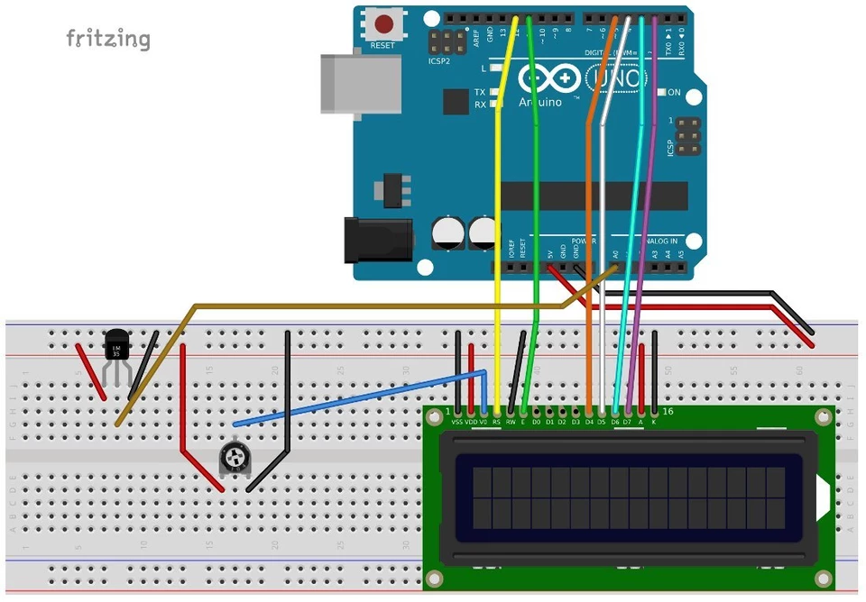
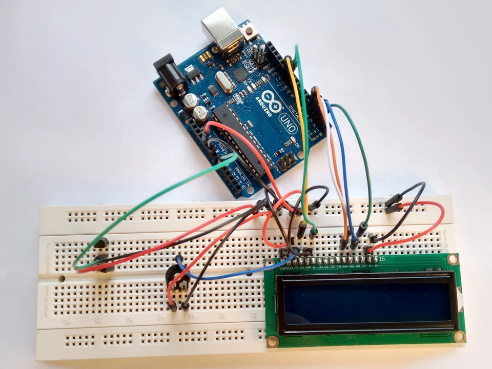

# Pantalla LCD

## Descripción del proyecto

En este último post del primer tutorial veremos cómo mostrar a través de una pantalla LCD la temperatura medida con el sensor LM35 que ya aprendimos a utilizar en el post 5. ¿una pantalla LCD? Sí, pero no la confundamos con la pantalla de nuestra televisión o la de nuestro smartphone, esas son pantallas LCD-TFT,LCD-SPI... nosotros usaremos una LCD simple y a un sólo color del tipo de las que podemos encontrar en calculadoras y algunos electrodomésticos.

## Material necesario

Suponiendo que ya tenemos nuestra placa Arduino Uno, nuestra protoboard y un juego de cables, tendremos que hacernos con el siguiente material:

- **Pantalla LCD** . En este caso he elegido una de 16 columnas y 2 líneas (16x2) por ser probablemente la más común. En tiendas online las he visto por unos 4 € envío incluido.
- **Sensor LM35** . Si seguiste el post 5 probablemente ya lo tendrás. Si no tampoco te preocupes porque no valdrá más de 2€ .
- **Potenciómetro 10k.** Lo necesitamos para ajustar el contraste de a pantalla. Sin él sería ilegible. Cuesta pocos céntimos.

## Montaje

Viendo la foto puede parecer complicado por la cantidad de cables que tiene, pero en realidad tener más conexiones no lo hace más difícil. Si hacemos las conexiones paso a paso nos funcionará a la primera. La que vamos a ver no es la única forma de conectar la pantalla, pero así podemos utilizar los códigos de ejemplo de la IDE para LCD sin cambiar ninguna línea. También tenéis que tener en cuenta que las pantallas las suelen vender con el agujero para soldarle un pin macho o un cable. Yo le he soldado una tira de pines macho para poder insertarla en la protoboard pero si no queréis soldar podéis meter los cables en los agujero con cuidado de que las puntas no se toquen entre sí. Ahora vamos a ver de izquierda a derecha como se conecta cada pin de la pantalla. Como los pines 5V y GND los vamos a utilizar en más de una conexión, los conectamos a las filas largas de nuestra protoboard y cuando un pin de la pantalla se corresponda con 5V o GND lo conectaremos con su fila correspondiente.



- VSS a la fila GND
- VDD a la fila 5 V
- V0 a la pata central del potenciómetro
- RS al pin 12
- RW a la fila GND
- E al pin 11
- D0 a D3 sin conexión
- D4 al pin 5
- D5 al pin 4
- D6 al pin 3
- D7 al pin 2
- A a la fila 5 V
- K a la fila GND
- Del potenciómetro conectamos una de las patas libres a GND y otra a 5 V
- Pata VS del sensor a la fila 5 V
- Pata central del sensor al pin A0
- Pata GND del sensor a la fila GND
- Si la pantalla no tiene iluminación prescindiremos de los pines A y K



No debemos olvidar que la primera vez que se conecta, tras alimentarla debemos ajustar el potenciómetro hasta encontrar el contraste óptimo. Antes de seguir podemos verificar que funciona perfectamente cargando uno de los códigos de ejemplo de la IDE como el que encontramos en Archivo → Ejemplos → LiquidCrystal → HelloWorld.

## Código

Sólo vamos a tratar en profundidad la parte del código que tiene que ver con el LCD y no con el sensor ya que está visto anteriormente. Al final del post está el código completo. En primer lugar teneos que añadir la librería para LCD en Esketch → Importar librería → LiquidCrystal o escribiendo

```
#include <LiquidCrystal.h>
```

Como la configuración de algunos pines puede variar tenemos que indicarle a la librería cuáles hemos utilizado.

```
LiquidCrysta lcd(12,11,5,4,3,2);
```

Ya podemos pasar a la función *setup* . Ahora iniciamos el LCD.

```
lcd.begin(6,2);
```

El 16 y el 2 se refiere al número de columnas y filas de nuestra pantalla. Lo siguiente es pasar a la función *loop* e indicar en qué posición de la pantalla queremos el cursor. De manera genérica, el comando es:

```
lcd.setCursor(columna, fila);
```

Pero ojo, empieza a contar desde cero, es decir, si queremos el cursor en la primera columna de la primera fila tendremos que escribir:

```
let.setCursor(0,0)
```

Una vez situado el cursor escribimos por pantalla la cadena de caracteres “Temperatura:”. Las cadenas de caracteres van entre comillas.

```
lcd.print(“Temperatura:”);
```

Suponiendo que ya hemos leído la temperatura y la tenemos almacenada en una variable llamada *temp* falta mostrarla por pantalla. Para que quepa la escribimos en la primera columna de la segunda fila:

```
lcd.setCursor(0, 1);
lcd.print(temp);
```

Y con esto escribirá el número que amacena la variable *temp* . Para que nuestro proyecto quede más estético escribiremos la cadena de caracteres “C” en la octava columna de la segunda fila (el símbolo “º” no se muestra correctamente).

```
lcd.setCursor(7, 1);
lcd.print(“C”);
```

Aunque es este código no vamos a tener problemas al sobrescribir, tenemos que tener en cuenta que sólo se borran las posiciones en las que se escriben, el resto sigue manteniendo los caracteres que mostraban anteriormente. Para limpiar la pantalla utilizaremos la opción clear que borrará toda la pantalla.

```
lcd.clear();
```

Por último, introducimos un *delay* al gusto para evitar que refresque tan rápido que no nos de tiempo a leer los datos antes de que cambien.